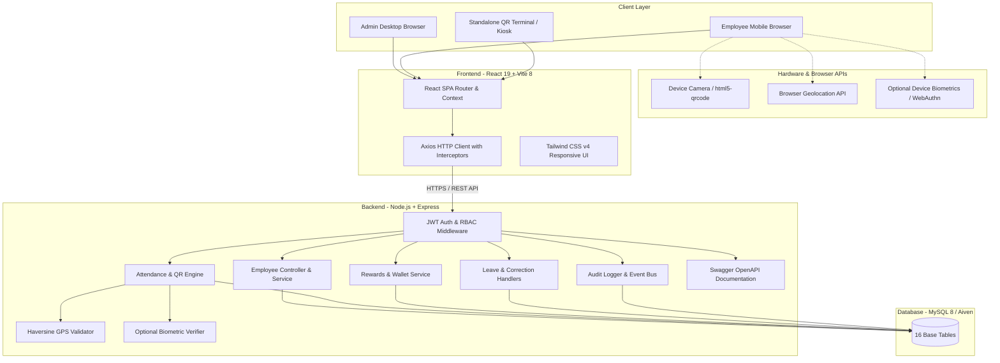
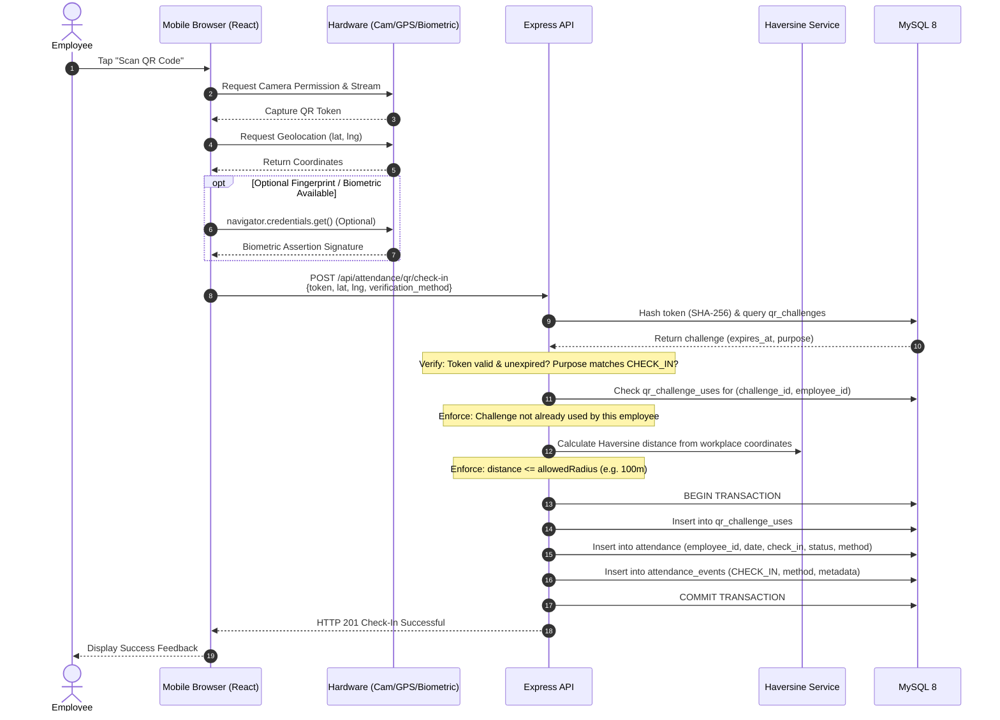
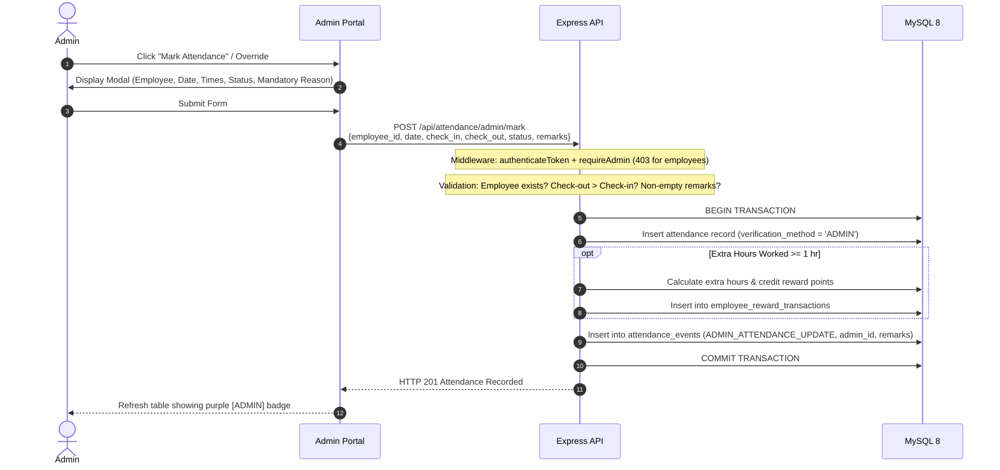
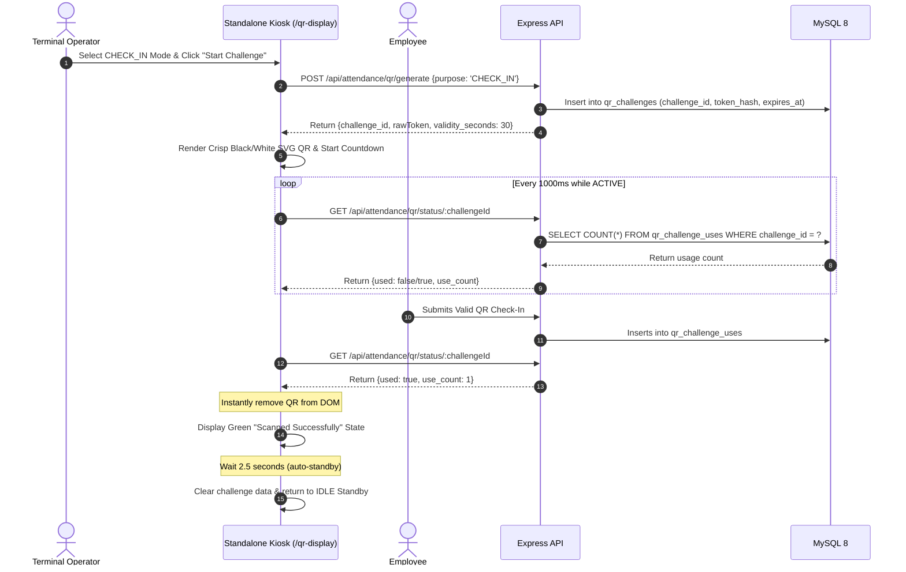
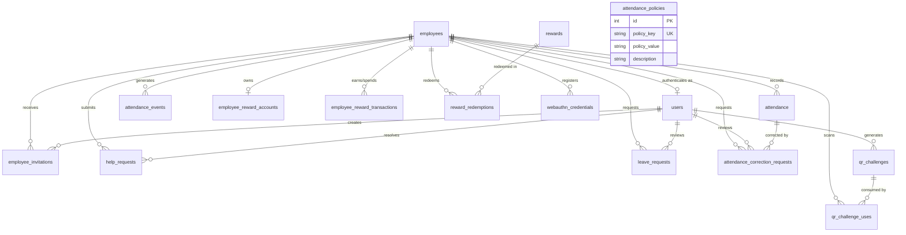

# AttendanceMS

> **Workforce Attendance Platform**  
> A secure, enterprise-grade workforce attendance and compliance management platform featuring dynamic rotating QR verification, workplace GPS geofencing, optional device-based fingerprint verification, administrative overrides, leave management, attendance corrections, automated extra-hour rewards, real-time presence tracking, immutable audit logging, and a dedicated standalone kiosk terminal.

---

## 📋 Table of Contents

1. [Overview](#overview)
2. [Submission Requirements](#submission-requirements)
   - [Mandatory](#mandatory)
   - [Optional Deliverables](#optional-deliverables)
3. [Submission Checklist](#submission-checklist)
4. [Requirements Traceability](#requirements-traceability)
5. [Features](#features)
   - [Original Assessment Requirements](#original-assessment-requirements)
   - [Bonus Requirements](#bonus-requirements)
   - [Additional Product Features](#additional-product-features)
   - [Assessment Live Enhancement Tasks](#assessment-live-enhancement-tasks)
6. [System Architecture](#system-architecture)
7. [Request & Attendance Verification Flows](#request--attendance-verification-flows)
   - [1. Employee QR Check-In Flow](#1-employee-qr-check-in-flow)
   - [2. Admin Manual Attendance Flow](#2-admin-manual-attendance-flow)
   - [3. QR Terminal Kiosk & Auto-Reset Flow](#3-qr-terminal-kiosk--auto-reset-flow)
8. [Security Architecture](#security-architecture)
9. [Database Design](#database-design)
   - [Entity-Relationship Diagram](#entity-relationship-diagram)
   - [Schema & Table Specifications (16 Tables)](#schema--table-specifications-16-tables)
10. [API Documentation](#api-documentation)
11. [Complete Local Setup & Configuration](#complete-local-setup--configuration)
12. [Docker Deployment](#docker-deployment)
13. [Cloud Deployment (Render + Aiven MySQL)](#cloud-deployment-render--aiven-mysql)
14. [Automated Test Suites](#automated-test-suites)
15. [Final Submission Package](#final-submission-package)

---

## Overview

**AttendanceMS** is a full-stack workforce attendance platform designed to eliminate buddy punching, proxy check-ins, and manual attendance tracking errors. It replaces legacy biometric hardware and paper registers with cryptographic QR tokens, client-side GPS geofencing verified strictly by the backend, optional device-level fingerprint / biometric verification, and a complete administrative oversight portal.

### Key Capabilities
- **Administrative Workforce Management**: Comprehensive employee lifecycle management, operational attendance policy tuning, audit trails, and attendance adjustments.
- **Employee Self-Service**: One-click check-in/out via mobile QR scanner, leave requests, attendance correction requests, and real-time personal attendance analytics.
- **Dynamic Rotating QR Attendance**: High-contrast, rotating cryptographic QR challenges that prevent token replay and screen captures.
- **Server-Authoritative Geofencing**: Workplace GPS distance verification calculated via the Haversine formula on the server.
- **Optional Fingerprint / Biometric Verification**: Optional device-level verification (e.g. fingerprint, Windows Hello, Touch ID) where supported by the employee's device and browser; zero raw biometric data is ever accessed, uploaded, or stored by the application.
- **Gamified Rewards & Points**: Automated reward points for overtime/extra hours worked, an employee points wallet, and a redeemable company rewards catalog.
- **Dedicated Standalone Kiosk**: A full-bleed, borderless display terminal (`/qr-display`) with live employee scan confirmation and automatic return-to-standby.

---

## Submission Requirements

This section directly maps all official submission deliverables to the actual files and implementations in this repository.

### Mandatory

#### 1. GitHub Repository
- **Deliverable**: Complete, clean source code repository containing frontend, backend, database schema, test scripts, and deployment configuration.
- **Repository URL**: [https://github.com/shxam69/Twite-AI.git](https://github.com/shxam69/Twite-AI.git)
- **Branch**: `main`

#### 2. Database Script (.sql)
- **Deliverable**: Canonical database schema file located at:
  ```
  database/schema.sql
  ```
- **Description**: Contains the complete, production-verified DDL definitions for all **16 base tables**, foreign key constraints, unique indexes, cascading rules, and default seed policies.
- **Runtime Migration vs. Schema SQL**:
  - `database/schema.sql`: Pure SQL schema file for initializing fresh MySQL 8 databases.
  - `backend/src/scripts/migrateFinal.js`: Programmatic Node.js migration runner that inspects `INFORMATION_SCHEMA` and applies idempotent migrations and column additions safely.
  - `backend/src/scripts/seedAdmin.js`: Runtime script to seed the default administrator account.

#### 3. README Documentation
- **Deliverable**: This `README.md` file located at the repository root.
- **Description**: Comprehensive technical reference covering project overview, feature categorization, architecture diagrams, sequence flows, database schema, API reference, security model, local setup instructions, Docker guide, cloud deployment, and test suite execution commands.

#### 4. Setup Instructions
- **Deliverable**: Complete, step-by-step setup documentation contained within [Complete Local Setup & Configuration](#complete-local-setup--configuration).
- **Coverage**: Prerequisites, dependency installation, database initialization, `.env` file configuration, concurrent dev mode, single-port production mode, Swagger access, and test execution.

#### 5. Screenshots or Demo Video
- **Deliverable**: Visual media capturing system features and execution flows.
- **Status**: ⚠️ **Recommended screenshots / demo video coverage** documented below (to be provided during evaluation/interview walkthrough):
  1. **Login Page**: Administrator and employee authentication with validation feedback.
  2. **Admin Dashboard**: Executive KPI metrics, today's attendance summary, and department breakdown charts.
  3. **Employee Management**: Employee directory, search/filtering, add employee modal, edit, and inactivation.
  4. **Daily Attendance Overview**: Records table with verification badges (`[QR]`, `[QR + Optional Biometric]`, `[ADMIN]`).
  5. **Admin Manual Attendance**: Administrative override modal with mandatory justification reason.
  6. **Standalone QR Terminal**: Full-bleed kiosk UI at `/qr-display` showing active rotating SVG QR code.
  7. **Employee Mobile Attendance**: Responsive mobile scanner capturing QR and requesting GPS.
  8. **GPS & Optional Fingerprint Verification**: Geofence radius check and optional device biometric prompt where supported.
  9. **Rewards & Points Portal**: `/admin/rewards` KPI cards, 7-day points trend, catalog manager, and redemptions.
  10. **Leave Requests**: Employee submission form and admin approve/reject review workflow.
  11. **Attendance Correction Requests**: Employee adjustment request and admin review modal.
  12. **Help Requests & Notifications**: Employee assistance submission and admin real-time notification toast.
  13. **Audit Log Timeline**: Immutable security event timeline with sanitized JSON metadata.
  14. **Attendance Settings**: Dynamic operational policies editor (`standard_work_hours`, geofence coordinates, etc.).
  15. **Swagger / OpenAPI Documentation**: Interactive API documentation at `/api/docs`.

---

### Optional Deliverables

#### 6. Live Deployment URL
- **Deliverable**: Fully hosted, active cloud deployment.
- **Live Application URL**: [https://twite-ai-1.onrender.com](https://twite-ai-1.onrender.com)
- **Live Health Probe**: [https://twite-ai-1.onrender.com/api/health](https://twite-ai-1.onrender.com/api/health)
- **Live Swagger API Docs**: [https://twite-ai-1.onrender.com/api/docs](https://twite-ai-1.onrender.com/api/docs)
- **Production Architecture**:
  $$\text{Render Cloud Web Service} \longrightarrow \text{Express Backend} \longrightarrow \text{React Production Dist} \longleftrightarrow \text{Aiven Cloud MySQL 8 (SSL)}$$

#### 7. Postman Collection
- **Status**: **Optional / Not included**.
- **Alternative**: The system includes a built-in interactive **Swagger / OpenAPI UI** at `/api/docs` which provides comprehensive endpoint exploration, schema definitions, and in-browser request execution with JWT bearer token support.

#### 8. Swagger Documentation
- **Deliverable**: Complete interactive Swagger 2.0 / OpenAPI 3.0 documentation.
- **Local URL**: `http://localhost:5000/api/docs`
- **Production URL**: `https://twite-ai-1.onrender.com/api/docs`
- **Implementation**: Generated via `swagger-jsdoc` and served with `swagger-ui-express` directly from the backend API.

---

## Submission Checklist

| # | Official Requirement | Deliverable Type | Status | Location / Verification Reference |
| :---: | :--- | :---: | :---: | :--- |
| **1** | **GitHub Repository** | Mandatory | ✅ Complete | [https://github.com/shxam69/Twite-AI.git](https://github.com/shxam69/Twite-AI.git) |
| **2** | **Database Script (.sql)** | Mandatory | ✅ Complete | [`database/schema.sql`](database/schema.sql) (16 tables) |
| **3** | **README Documentation** | Mandatory | ✅ Complete | [`README.md`](README.md) (Architecture, APIs, Setup, Security) |
| **4** | **Setup Instructions** | Mandatory | ✅ Complete | [Section: Complete Local Setup](#complete-local-setup--configuration) |
| **5** | **Screenshots / Demo Video** | Mandatory | ⚠️ Documented | 15 core demo flows specified for interview submission |
| **6** | **Live Deployment URL** | Optional | ✅ Complete | [https://twite-ai-1.onrender.com](https://twite-ai-1.onrender.com) |
| **7** | **Postman Collection** | Optional | ⚪ Not included | Interactive Swagger UI available at `/api/docs` |
| **8** | **Swagger Documentation** | Optional | ✅ Complete | Built-in live at `/api/docs` |

---

## Requirements Traceability

This matrix maps every foundational requirement from the technical assessment specification directly to its implementation in AttendanceMS:

| Original Requirement | Specification Requirement | Current Implementation | Relevant Code / File |
| :--- | :--- | :--- | :--- |
| **Authentication** | Username/password login, JWT tokens, bcrypt encryption, RBAC. | Stateless JWT auth, bcrypt password hashing, `authenticateToken` and `requireAdmin` middlewares. | `backend/src/controllers/authController.js`<br/>`backend/src/middleware/authMiddleware.js` |
| **Employee Management** | Full CRUD: Employee ID, Name, Email, Phone, Department, Designation, Status. | Complete directory with unique Employee ID & Email, soft delete (`status = 'inactive'`), active filters. | `backend/src/controllers/employeeController.js`<br/>`frontend/src/pages/EmployeesPage.jsx` |
| **Attendance Tracking** | Check-in, check-out, status, employee history, summary, duplicate prevention. | Daily punches, worked hour calculations, status assignment, `(employee_id, date)` DB uniqueness. | `backend/src/services/attendanceService.js`<br/>`frontend/src/pages/AttendancePage.jsx` |
| **Dashboard** | Total employees, active count, present today, absent today, department counts. | Real-time executive metrics, dynamic department headcount grouping, personal monthly stats. | `backend/src/controllers/dashboardController.js`<br/>`frontend/src/pages/DashboardPage.jsx` |
| **Database Architecture** | Relational schema with normalized tables, foreign keys, and indexes. | MySQL 8 schema with 16 tables, cascading constraints, unique compound indexes, and pooling. | `database/schema.sql`<br/>`backend/src/config/db.js` |
| **RESTful API** | Clean REST conventions with status codes, error handling, and JSON responses. | Structured `/api/*` endpoints with centralized error handling middleware and standard HTTP codes. | `backend/src/app.js`<br/>`backend/src/middleware/errorHandler.js` |
| **Pagination** | Server-side pagination for employee and attendance records. | SQL `LIMIT` and `OFFSET` query handling with `page` and `limit` parameters on list endpoints. | `backend/src/controllers/employeeController.js`<br/>`backend/src/controllers/attendanceController.js` |
| **Search & Filtering** | Multi-attribute search and filtering across records. | Text search (name, email, employee ID) and dropdown filters (department, status, date range). | `frontend/src/pages/EmployeesPage.jsx`<br/>`frontend/src/pages/AttendancePage.jsx` |
| **Sorting** | Dynamic column sorting for tabular data. | Server-supported and client-side sorting by creation date, name, and attendance timestamps. | `frontend/src/pages/EmployeesPage.jsx` |
| **Responsive UI** | Mobile-friendly and desktop-optimized layouts. | Tailwind CSS v4 styling with responsive breakpoints, collapsible navigation, and modal dialogues. | `frontend/src/components/Sidebar.jsx`<br/>`frontend/src/layouts/MainLayout.jsx` |
| **RBAC Security** | Distinct views and permissions for Admin and Employee roles. | `ProtectedRoute` wrapper on client routes; server-side 403 Forbidden for unauthorized endpoints. | `frontend/src/components/ProtectedRoute.jsx`<br/>`backend/src/middleware/authMiddleware.js` |
| **Docker Support** | Containerized deployment for easy portability. | Multi-container `docker-compose.yml` linking MySQL 8, Node backend, and Nginx frontend. | `docker-compose.yml`<br/>`backend/Dockerfile`<br/>`frontend/Dockerfile` |
| **Automated Testing** | Unit and integration test coverage for core workflows. | 10 comprehensive automated test suites verifying RBAC, token security, geofencing, and rewards. | `backend/src/scripts/test*.js` |
| **Swagger / OpenAPI** | API documentation and testing interface. | Interactive Swagger UI mounted at `/api/docs` using JSDoc specifications. | `backend/src/config/swagger.js`<br/>`backend/src/app.js` |
| **Export Data** | Download attendance records in tabular format. | Streaming CSV export endpoint with custom date filtering and instant browser download. | `backend/src/controllers/attendanceController.js`<br/>`GET /api/attendance/export` |
| **Live Task 1: Department Filter** | Filter attendance records by department. | Implemented on both backend (`?department=X`) and frontend attendance table filter dropdowns. | `frontend/src/pages/AttendancePage.jsx`<br/>`backend/src/controllers/attendanceController.js` |
| **Live Task 2: Attendance %** | Calculate employee attendance compliance percentage. | Dynamic formula: $(\text{Present Days} / \text{Total Working Days}) \times 100$ on summary endpoints. | `backend/src/services/attendanceService.js`<br/>`frontend/src/pages/AttendancePage.jsx` |
| **Live Task 3: Status Filter** | Filter employees by active and inactive status. | Status dropdown filter on `/employees` passing `?status=active` or `?status=inactive`. | `frontend/src/pages/EmployeesPage.jsx` |
| **Live Task 4: Export to CSV** | Export attendance records to file. | Single-click "Export CSV" button generating clean, comma-separated attendance reports. | `frontend/src/pages/AttendancePage.jsx`<br/>`backend/src/controllers/attendanceController.js` |

---

## Features

### Original Assessment Requirements

The foundational assessment specifications:

#### 1. Authentication
- **Username & Password Authentication**: Validated against database credentials.
- **Password Security**: Salted bcrypt password hashing with configurable salt rounds.
- **JWT Architecture**: Signed, stateless JSON Web Tokens issued on login.
- **Role-Based Access Control (RBAC)**: Distinct permissions for `admin` and `employee`.

#### 2. Employee Management
- **Identity Fields**: Employee ID (`EMP-xxx`), Name, Email, Mobile, Department, Designation, Status (`active` / `inactive`).
- **Complete CRUD**: Create new employees, update details, inspect records, and soft-delete.
- **Search & Filter**: Search by name/email/ID; filter by department and status.
- **Soft Delete**: Inactivation changes status to `inactive`, preserving historical integrity.

#### 3. Attendance Management
- **Daily Attendance**: Tracks employee ID, calendar date, check-in time, check-out time, and status (`present`, `absent`, `late`, `half_day`).
- **History & Aggregations**: Detailed per-employee history logs and aggregated summaries.
- **Duplicate Prevention**: Database-level unique constraint on `(employee_id, attendance_date)`.

#### 4. Dashboard & Metrics
- **Executive Counters**: Total employees, active employees, present today, and absent today.
- **Department Headcount Breakdown**: Live employee counts grouped by corporate department.
- **Personal Metrics**: Personal attendance compliance and punch timestamps for logged-in employees.

---

### Bonus Requirements

Items implemented from the bonus specification:

- **JWT Authentication Architecture**: Secure bearer token transmission and validation.
- **Server-Side Pagination**: Efficient pagination handling large employee directories.
- **Dynamic Filtering & Sorting**: Multi-column sorting and combined search filters.
- **Responsive UI**: Tailwind CSS styling tested on mobile, tablet, and widescreen monitors.
- **Role-Based Routing**: Protected client routes and server-side RBAC middleware.
- **Docker Containerization**: Multi-service `docker-compose.yml` environment.
- **Cloud Deployment**: Automated deployment via `render.yaml` with managed database connection.
- **Test Suites**: Automated test scripts verifying API behavior, security, and schema.
- **Swagger / OpenAPI**: Live interactive documentation at `/api/docs`.
- **CSV Data Export**: Single-click streaming CSV attendance report download.

---

### Additional Product Features

Architectural enhancements built beyond the baseline specification:

#### 1. Dynamic Rotating QR Attendance & Dedicated Kiosk
- **Standalone Kiosk Terminal (`/qr-display`)**: Full-bleed, borderless display terminal designed for office tablets or entry monitors. Free of sidebars, headers, and navigation controls.
- **Rotating Challenges**: Cryptographically secure 64-character tokens rotating every 30 seconds.
- **Multi-Employee Concurrency**: Multiple employees can scan the same active QR challenge during its active validity window.
- **Anti-Replay Protection**: An employee cannot use the same challenge token more than once (`qr_challenge_uses` constraint).
- **Hashed Token Storage**: The raw QR token is never stored in the database; only its SHA-256 hash is persisted.
- **Dual Mode Switcher**: Quick toggle between `CHECK_IN` and `CHECK_OUT` modes.
- **Real-Time Scan Confirmation & Auto-Standby Reset**: When an employee successfully scans and checks in, the terminal immediately removes the QR code, displays a prominent emerald `"Scanned Successfully"` state for 2.5 seconds, and automatically returns to standby ready for the next employee.

#### 2. Workplace GPS Geofencing
- **Configurable Coordinates**: Admin-configured workplace latitude, longitude, and allowed radius (default: 100 meters) in `attendance_policies`.
- **Server-Authoritative Validation**: Client-provided GPS coordinates are verified on the backend using the Haversine formula.
- **No Spoofing**: The client's self-reported `location_verified` flag is ignored; distance is calculated and verified server-side.
- **Zero Background Tracking**: Geolocation is requested strictly on-demand at the moment of scan; no persistent background GPS tracking is performed.

#### 3. Optional Fingerprint Verification (WebAuthn)
AttendanceMS supports optional device-based biometric verification where supported by the employee's device and browser. Fingerprint authentication can provide an additional verification layer during attendance.

- **Fingerprint verification is NOT mandatory**: The core, authoritative employee attendance flow remains **QR scanning combined with GPS/geofencing verification**.
- **Supported Device Fallback**: If a device does not support a suitable biometric authenticator, or if biometric verification is not configured, the employee can continue using the normal QR + GPS attendance flow without restriction.
- **Zero Biometric Data Handled**: AttendanceMS **never accesses, captures, uploads, or stores raw fingerprint or biometric data**. Any supported device-level biometric verification is handled strictly by the operating system/browser security layer via the standard WebAuthn API; only cryptographic public-key assertion metadata is verified.
- **Device Incompatibility Resilience**: Employees without fingerprint or biometric capabilities are never blocked from completing attendance; standard QR + GPS verification fulfills all requirements.
- **Security Distinction**: Biometrics are completely optional; however, if an enrolled employee explicitly chooses to authenticate with their biometric prompt and actively cancels or fails the prompt, the operation is blocked to prevent bypass of an in-progress verification attempt.

#### 4. Admin Manual Attendance Override
- **Administrative Override (`/admin/attendance`)**: An authorized capability for admins to mark or update attendance when an employee forgets their phone, experiences device failure, or requires manual adjustment.
- **Mandatory Justification**: Requires an administrative reason (e.g. *"Employee phone unavailable; approved by manager"*).
- **Visual Auditing**: Displayed in the Attendance table with a distinctive `🛡️ ADMIN` badge and tracked via `verification_method = 'ADMIN'`.
- **Integrity & Rewards**: Full RBAC protection (employees receive `403 Forbidden`), duplicate-date protection, and automatic extra-hour reward point recalculation.

#### 5. Leave Management (`/leaves`)
- **Employee Submissions**: Self-service application for `CASUAL`, `SICK`, `ANNUAL`, or `UNPAID` leave with start date, end date, and reason.
- **Admin Review Workflow**: Admins review pending requests with one-click `Approve` or `Reject` actions and optional review comments.
- **Status Badging**: High-contrast status badges (`PENDING`, `APPROVED`, `REJECTED`).

#### 6. Attendance Correction Requests (`/attendance/corrections`)
- **Correction Workflow**: Employees can submit correction requests for past attendance records (e.g., missed checkout or incorrect punch time).
- **Administrative Review**: Admins inspect the requested check-in/out times, reason, and original punch before approving or rejecting.
- **Atomic Correction**: Approving a correction automatically updates the underlying attendance record.

#### 7. Employee Help Requests (`/api/help-requests`)
- **Assistance Center**: Employees facing QR scanner issues, GPS errors, or punch difficulties can submit structured help requests.
- **Real-Time Notification Toast**: Admins receive floating in-app notification toasts and header badges for new open requests.
- **Resolution Tracking**: Admins can mark help requests as resolved with recorded reviewer metadata.

#### 8. Immutable Audit Trail (`/admin/audit-log`)
- **Comprehensive Event Logging**: All attendance actions (`CHECK_IN`, `CHECK_OUT`, `CHECK_IN_FAILED`, `ADMIN_ATTENDANCE_UPDATE`, `WEBAUTHN_VERIFIED`, etc.) log an immutable audit record in `attendance_events`.
- **Actor Attribution**: Stores admin user ID and username for all overrides.
- **Sanitized Metadata**: Sensitive security tokens, raw QR keys, and biometric details are strictly excluded from audit payloads.

#### 9. Gamified Rewards & Points System (`/admin/rewards`)
- **Extra-Hour Rewards**: Employees automatically earn reward points for completed overtime work:
  $$\text{extra\_hours} = \max\left(0, \lfloor \text{worked\_hours} - \text{standard\_work\_hours} \rfloor\right)$$
  $$\text{points\_awarded} = \text{extra\_hours} \times \text{reward\_points\_per\_extra\_hour}$$
  *(Defaults: 8 standard work hours, 100 points per extra hour).*
- **Employee Points Wallet**: Real-time balance and lifetime points display with an interactive 7-day, 30-day, and 90-day daily earning history chart (guaranteeing zero-point representations on non-working days).
- **Company Reward Catalog**: Admin-managed catalog of vouchers, gifts, and perks with stock tracking and active/inactive toggles.
- **Atomic Redemptions**: Atomic database transactions that deduct points, decrement inventory, and support admin fulfillment or cancellation with automatic wallet refunds.

#### 10. Operational Policies / Settings (`/attendance/settings`)
- **Dynamic Policy Engine**: Operational and security policies are stored in the database (`attendance_policies`) and tunable via the Admin UI without code redeployment or server restarts.
- Configurable settings include: office start time, grace period, standard work hours, extra-hour reward rates, geofence coordinates, geofence radius, and QR token validity duration.

---

### Assessment Live Enhancement Tasks

During the assessment, four specific live enhancement capabilities were evaluated:

| Task | Scope & Purpose | Implementation Status |
| :--- | :--- | :--- |
| **1. Department Filter** | Filter attendance lists and summaries by employee department. | **Fully Implemented**: Integrated into `AttendancePage.jsx`, `EmployeesPage.jsx`, and backend queries (`GET /api/attendance?department=Engineering`). |
| **2. Attendance Percentage** | Compute and display employee attendance compliance percentages. | **Fully Implemented**: Real-time calculation in `attendanceService.getAttendanceSummary` and displayed on employee and admin dashboards. |
| **3. Employee Status Filter** | Filter employees and historical records by `active` or `inactive` state. | **Fully Implemented**: Built into `EmployeesPage.jsx` and backend `employeeController.getEmployees` (`?status=active`). |
| **4. Export to CSV** | Stream formatted attendance history as a downloadable CSV report. | **Fully Implemented**: Delivered via `GET /api/attendance/export` with custom date range filters and browser streaming download. |

---

## System Architecture

AttendanceMS implements a backend-authoritative 3-tier architecture:



### Architectural Layers

1. **Client Layer**:
   - **Admin Portal**: Executive dashboard, employee directory, attendance controls, rewards manager, policies, and audit timeline.
   - **Employee Portal**: Mobile-first self-service interface for QR scanning, leave submission, correction requests, and wallet redemptions.
   - **QR Terminal (`/qr-display`)**: Lightweight, standalone kiosk designed for wall-mounted tablet displays.
2. **Frontend Layer**: Built with React 19, Vite 8, and Tailwind CSS v4. Uses Axios interceptors for JWT injection and centralized error handling.
3. **Application Layer**: Express.js REST API with modular controllers, services, repositories, and custom middlewares. All business rules, geofence calculations, and token validations execute here.
4. **Data Layer**: MySQL 8.0 (hosted on Aiven in production). Configured with connection pooling (`mysql2/promise`), strict foreign key constraints, and transactional consistency for attendance check-ins and reward redemptions.

---

## Request & Attendance Verification Flows

### 1. Employee QR Check-In Flow



---

### 2. Admin Manual Attendance Flow



---

### 3. QR Terminal Kiosk & Auto-Reset Flow



---

## Security Architecture

| Security Domain | Implementation Mechanism | Threat Mitigation |
| :--- | :--- | :--- |
| **Authentication** | JSON Web Tokens (HMAC-SHA256) signed with high-entropy secret; 1-day expiration. | Session hijacking, forged identities. |
| **Password Storage** | Salted `bcryptjs` hashing with automated work factor scaling. | Database credential dumps, rainbow tables. |
| **Role-Based Access** | Declarative `requireAdmin` middleware enforcing database-verified user roles. | Privilege escalation, unauthorized admin access. |
| **Tenant Isolation** | Employee endpoints resolve identity strictly from `req.user.employee_id`. | Cross-tenant data tampering, insecure direct object references (IDOR). |
| **Anti-Replay QR** | Ephemeral UUIDs, 30-second expiry, and unique constraint on `(challenge_id, employee_id)`. | Replayed tokens, QR photo sharing, duplicate punches. |
| **Cryptographic QR Hashing** | SHA-256 token hashing; plaintext tokens never persisted in database tables. | Internal token theft from database backups. |
| **Server-Side GPS** | Server evaluates Haversine distance against workplace coordinates; ignores client claims. | Mock GPS location spoofers, modified client apps. |
| **Biometric Privacy (Optional)** | Optional device biometric verification; zero raw fingerprint or biometric templates stored. Handled via browser/OS WebAuthn layer. | Biometric privacy violations, credential compromise. |
| **Optional Biometric Resilience** | Unenrolled/unsupported devices cleanly use standard QR + GPS flow; failed in-progress biometric attempts cannot be bypassed. | Device incompatibility lockouts, verification bypass attacks. |
| **Audit Sanitization** | `attendance_events` JSON metadata scrubbed of tokens, passwords, and secrets. | Audit log credential leakage. |
| **Integrity Constraints** | Foreign keys with `ON DELETE CASCADE / SET NULL` and unique constraints. | Orphan records, duplicate-date attendance records. |

---

## Database Design

### Entity-Relationship Diagram



---

### Schema & Table Specifications (16 Tables)

The database consists of **16 production base tables**:

#### 1. `employees`
- **Purpose**: Primary master table storing employee identity and corporate profile details.
- **Primary Key**: `id` (`INT AUTO_INCREMENT`)
- **Key Columns**: `employee_id` (`VARCHAR(20) UNIQUE`), `name`, `email` (`VARCHAR(100) UNIQUE`), `mobile`, `department`, `designation`, `status` (`ENUM('active', 'inactive') DEFAULT 'active'`).
- **Indexes**: `idx_employees_employee_id`, `idx_employees_email`, `idx_employees_department`, `idx_employees_status`.

#### 2. `users`
- **Purpose**: User authentication credentials and role assignments.
- **Primary Key**: `id` (`INT AUTO_INCREMENT`)
- **Foreign Keys**: `employee_id` $\rightarrow$ `employees(id) ON DELETE SET NULL`
- **Key Columns**: `username` (`VARCHAR(50) UNIQUE`), `password` (bcrypt hash), `role` (`ENUM('admin', 'employee')`).

#### 3. `attendance`
- **Purpose**: Daily attendance punches, worked hours, and status.
- **Primary Key**: `id` (`INT AUTO_INCREMENT`)
- **Foreign Keys**: `employee_id` $\rightarrow$ `employees(id) ON DELETE CASCADE`
- **Unique Constraint**: `uk_employee_attendance_date` on `(employee_id, attendance_date)`
- **Key Columns**: `attendance_date` (`DATE`), `check_in` (`TIME`), `check_out` (`TIME`), `status` (`ENUM('present', 'absent', 'late', 'half_day')`), `verification_method` (`ENUM('MANUAL', 'QR', 'WEBAUTHN', 'QR_WEBAUTHN', 'AUTO_LOCATION', 'ADMIN')` where `'QR'` represents the core mandatory QR+GPS flow and `'QR_WEBAUTHN'` represents attendance with optional fingerprint/biometric verification), `remarks` (`TEXT`).

#### 4. `employee_invitations`
- **Purpose**: Tracks single-use cryptographic invitation tokens for employee self-registration.
- **Primary Key**: `id` (`INT AUTO_INCREMENT`)
- **Foreign Keys**: `employee_id` $\rightarrow$ `employees(id)`, `created_by` $\rightarrow$ `users(id)`
- **Key Columns**: `token_hash` (`VARCHAR(255) UNIQUE`), `expires_at`, `used_at`.

#### 5. `attendance_events`
- **Purpose**: Immutable security audit log tracking attendance events, methods, and actors.
- **Primary Key**: `id` (`INT AUTO_INCREMENT`)
- **Foreign Keys**: `employee_id` $\rightarrow$ `employees(id) ON DELETE CASCADE`
- **Key Columns**: `event_type` (`CHECK_IN`, `CHECK_OUT`, `CHECK_IN_FAILED`, `ADMIN_ATTENDANCE_UPDATE`, etc.), `verification_method`, `metadata` (`JSON`), `created_at`.

#### 6. `attendance_policies`
- **Purpose**: Dynamic system configuration for operational hours, geofences, and reward rates.
- **Primary Key**: `id` (`INT AUTO_INCREMENT`)
- **Key Columns**: `policy_key` (`VARCHAR(50) UNIQUE`), `policy_value` (`VARCHAR(255)`), `description`.

#### 7. `qr_challenges`
- **Purpose**: Stores active rotating QR challenges with cryptographic expiration windows.
- **Primary Key**: `id` (`INT AUTO_INCREMENT`)
- **Foreign Keys**: `created_by` $\rightarrow$ `users(id)`
- **Key Columns**: `challenge_id` (`VARCHAR(64) UNIQUE`), `token_hash` (`VARCHAR(64) UNIQUE`), `purpose` (`ENUM('CHECK_IN', 'CHECK_OUT')`), `expires_at`.

#### 8. `qr_challenge_uses`
- **Purpose**: Enforces single-use challenge consumption per employee (anti-replay protection).
- **Primary Key**: `id` (`INT AUTO_INCREMENT`)
- **Foreign Keys**: `challenge_id` $\rightarrow$ `qr_challenges(id)`, `employee_id` $\rightarrow$ `employees(id)`
- **Unique Constraint**: `uk_challenge_employee` on `(challenge_id, employee_id)`.

#### 9. `help_requests`
- **Purpose**: Employee assistance tickets for QR scanning, location, or attendance issues.
- **Primary Key**: `id` (`INT AUTO_INCREMENT`)
- **Foreign Keys**: `employee_id` $\rightarrow$ `employees(id)`, `resolved_by` $\rightarrow$ `users(id)`
- **Key Columns**: `request_type`, `message`, `status` (`ENUM('OPEN', 'RESOLVED')`), `resolved_at`.

#### 10. `leave_requests`
- **Purpose**: Formal employee leave applications and supervisor approvals.
- **Primary Key**: `id` (`INT AUTO_INCREMENT`)
- **Foreign Keys**: `employee_id` $\rightarrow$ `employees(id)`, `reviewed_by` $\rightarrow$ `users(id)`
- **Key Columns**: `leave_type` (`CASUAL`, `SICK`, `ANNUAL`, `UNPAID`), `start_date`, `end_date`, `reason`, `status` (`PENDING`, `APPROVED`, `REJECTED`), `admin_comment`.

#### 11. `attendance_correction_requests`
- **Purpose**: Post-hoc punch adjustments submitted by employees for administrative review.
- **Primary Key**: `id` (`INT AUTO_INCREMENT`)
- **Foreign Keys**: `employee_id` $\rightarrow$ `employees(id)`, `attendance_id` $\rightarrow$ `attendance(id)`, `reviewed_by` $\rightarrow$ `users(id)`
- **Key Columns**: `requested_date`, `requested_check_in`, `requested_check_out`, `requested_status`, `reason`, `status`.

#### 12. `employee_reward_accounts`
- **Purpose**: Employee rewards wallet balance and lifetime earned point tracking.
- **Primary Key**: `id` (`INT AUTO_INCREMENT`)
- **Foreign Keys**: `employee_id` $\rightarrow$ `employees(id) ON DELETE CASCADE` (Unique)
- **Key Columns**: `balance` (`INT`), `total_earned` (`INT`).

#### 13. `employee_reward_transactions`
- **Purpose**: Immutable ledger tracking all point credits, deductions, and refunds.
- **Primary Key**: `id` (`INT AUTO_INCREMENT`)
- **Foreign Keys**: `employee_id` $\rightarrow$ `employees(id)`
- **Key Columns**: `amount` (`INT`), `type` (`EXTRA_HOURS_EARNED`, `REWARD_REDEEMED`, `ADMIN_ADJUSTMENT`, `REFUND`), `reference_id`, `description`.

#### 14. `rewards`
- **Purpose**: Company rewards catalog items available for redemption.
- **Primary Key**: `id` (`INT AUTO_INCREMENT`)
- **Key Columns**: `name`, `description`, `points_cost` (`INT`), `stock_quantity` (`INT DEFAULT 100`), `status` (`ENUM('active', 'inactive')`).

#### 15. `reward_redemptions`
- **Purpose**: Employee reward redemption requests and inventory fulfillment lifecycle.
- **Primary Key**: `id` (`INT AUTO_INCREMENT`)
- **Foreign Keys**: `employee_id` $\rightarrow$ `employees(id)`, `reward_id` $\rightarrow$ `rewards(id)`
- **Key Columns**: `points_spent`, `status` (`ENUM('PENDING', 'APPROVED', 'FULFILLED', 'CANCELLED')`).

#### 16. `webauthn_credentials`
- **Purpose**: Registered WebAuthn platform public keys for optional device biometric / passkey authentication.
- **Primary Key**: `id` (`INT AUTO_INCREMENT`)
- **Foreign Keys**: `employee_id` $\rightarrow$ `employees(id) ON DELETE CASCADE`
- **Key Columns**: `credential_id` (`VARCHAR(500) UNIQUE`), `public_key` (`TEXT`), `counter` (`BIGINT`), `device_type`, `transports`.

---

## API Documentation

The complete interactive Swagger documentation is served live at:
```
http://localhost:5000/api/docs
```

### Core API Endpoints

#### Authentication (`/api/auth`)
| Method | Endpoint | Authorization | Purpose |
| :--- | :--- | :--- | :--- |
| `POST` | `/api/auth/login` | Public | Authenticate username/password; return JWT token. |
| `GET` | `/api/auth/me` | Authenticated | Fetch current user session details and employee link. |
| `GET` | `/api/auth/admin-check` | Admin | Health check verifying caller has admin privileges. |
| `GET` | `/api/auth/register/invitation/:token` | Public | Validate employee registration invitation token. |
| `POST` | `/api/auth/register/employee` | Public | Complete employee self-registration via token. |

#### Employees (`/api/employees`)
| Method | Endpoint | Authorization | Purpose |
| :--- | :--- | :--- | :--- |
| `GET` | `/api/employees` | Authenticated | Paginated, filtered, and sorted employee directory. |
| `POST` | `/api/employees` | Admin | Create a new employee record. |
| `GET` | `/api/employees/:id` | Authenticated | Fetch single employee profile by ID. |
| `PUT` | `/api/employees/:id` | Admin | Update employee profile details. |
| `DELETE` | `/api/employees/:id` | Admin | Soft-delete employee (`status = 'inactive'`). |
| `POST` | `/api/employees/:id/invite` | Admin | Generate one-time registration invitation link. |
| `GET` | `/api/employees/:id/invitation` | Admin | Check invitation link status and registration state. |
| `POST` | `/api/employees/:id/invite/revoke`| Admin | Revoke an active invitation token. |

#### Attendance (`/api/attendance`)
| Method | Endpoint | Authorization | Purpose |
| :--- | :--- | :--- | :--- |
| `GET` | `/api/attendance` | Authenticated | List attendance records with date, department, and status filters. |
| `POST` | `/api/attendance/check-in` | Authenticated | Quick check-in for authenticated employee. |
| `POST` | `/api/attendance/check-out` | Authenticated | Quick check-out for authenticated employee. |
| `GET` | `/api/attendance/summary` | Authenticated | Aggregated attendance statistics and compliance percentage. |
| `GET` | `/api/attendance/employee/:id` | Authenticated | Per-employee historical attendance records. |
| `POST` | `/api/attendance/admin/mark` | Admin | **Admin Override**: Manually create an attendance record. |
| `PUT` | `/api/attendance/admin/:id` | Admin | **Admin Override**: Update an existing attendance record. |
| `PUT` | `/api/attendance/:id/remark` | Admin | Update administrative remark on an attendance entry. |
| `GET` | `/api/attendance/export` | Admin | Download attendance records as a streaming CSV file. |
| `GET` | `/api/attendance/events` | Admin | Retrieve paginated security and attendance audit events. |
| `GET` | `/api/attendance/policies` | Admin | List configured operational and security policies. |
| `PUT` | `/api/attendance/policies/:key`| Admin | Update an attendance policy setting. |

#### Dynamic QR Attendance (`/api/attendance/qr`)
| Method | Endpoint | Authorization | Purpose |
| :--- | :--- | :--- | :--- |
| `POST` | `/api/attendance/qr/generate` | Admin | Generate dynamic rotating QR challenge token. |
| `GET` | `/api/attendance/qr/status/:id` | Admin | **Kiosk Polling**: Detect whether challenge was scanned. |
| `POST` | `/api/attendance/qr/check-in` | Authenticated | Submit QR token + GPS coordinates for check-in. |
| `POST` | `/api/attendance/qr/check-out` | Authenticated | Submit QR token + GPS coordinates for check-out. |

#### Optional Fingerprint / WebAuthn APIs (`/api/auth/webauthn`)
*Note: Fingerprint verification is an OPTIONAL additional layer. The core mandatory employee attendance verification flow remains QR + GPS.*
| Method | Endpoint | Authorization | Purpose |
| :--- | :--- | :--- | :--- |
| `GET` | `/api/auth/webauthn/register/options`| Authenticated | Generate optional WebAuthn passkey registration challenge. |
| `POST` | `/api/auth/webauthn/register/verify` | Authenticated | Verify device attestation & save public key credential. |
| `GET` | `/api/auth/webauthn/auth/options` | Authenticated | Generate optional WebAuthn assertion authentication challenge. |
| `POST` | `/api/auth/webauthn/authenticate/verify`| Authenticated | Verify device biometric signature proof. |
| `GET` | `/api/auth/webauthn/credentials` | Authenticated | List enrolled device authenticators for employee. |
| `DELETE`| `/api/auth/webauthn/credentials/:id`| Authenticated | Revoke an enrolled platform authenticator. |
| `POST` | `/api/auth/webauthn/status` | Authenticated | Log client WebAuthn availability/skip audit event. |

#### Rewards & Points (`/api/rewards`)
| Method | Endpoint | Authorization | Purpose |
| :--- | :--- | :--- | :--- |
| `GET` | `/api/rewards/my-account` | Authenticated | Fetch employee wallet balance & recent transactions. |
| `GET` | `/api/rewards/points-history` | Authenticated | 7/30/90-day daily points history chart data. |
| `GET` | `/api/rewards/catalog` | Authenticated | Browse active reward catalog items with points cost. |
| `POST` | `/api/rewards/redeem` | Authenticated | Redeem reward item with atomic points deduction. |
| `GET` | `/api/rewards/stats` | Admin | Rewards executive KPI stats, trend data, and top earners. |
| `POST` | `/api/rewards` | Admin | Create a new reward catalog item. |
| `PUT` | `/api/rewards/:id` | Admin | Update reward catalog item (title, points, stock, status). |
| `GET` | `/api/rewards/redemptions` | Admin | List redemption requests with status filters. |
| `PATCH`| `/api/rewards/redemptions/:id`| Admin | Fulfill redemption or cancel with automatic refund. |

#### Leave & Corrections (`/api/leave-requests`, `/api/attendance/corrections`)
| Method | Endpoint | Authorization | Purpose |
| :--- | :--- | :--- | :--- |
| `POST` | `/api/leave-requests` | Authenticated | Submit leave application. |
| `GET` | `/api/leave-requests/my` | Authenticated | List personal leave applications. |
| `GET` | `/api/leave-requests` | Admin | List all employee leave applications. |
| `PUT` | `/api/leave-requests/:id/approve`| Admin | Approve leave request. |
| `PUT` | `/api/leave-requests/:id/reject` | Admin | Reject leave request with comment. |
| `POST` | `/api/attendance/corrections` | Authenticated | Submit punch correction request. |
| `GET` | `/api/attendance/corrections/my`| Authenticated | List personal correction requests. |
| `GET` | `/api/attendance/corrections` | Admin | List all pending punch correction requests. |
| `PATCH`| `/api/attendance/corrections/:id/approve`| Admin | Approve correction & atomically update attendance. |
| `PATCH`| `/api/attendance/corrections/:id/reject` | Admin | Reject correction request with comment. |

#### Help Requests & Dashboard (`/api/help-requests`, `/api/dashboard`, `/api/health`)
| Method | Endpoint | Authorization | Purpose |
| :--- | :--- | :--- | :--- |
| `POST` | `/api/help-requests` | Authenticated | Submit employee assistance request. |
| `GET` | `/api/help-requests/open-count` | Admin | Real-time count of unresolved help tickets. |
| `GET` | `/api/dashboard/stats` | Admin | Executive dashboard metrics, presence, and departments. |
| `GET` | `/api/dashboard/my-stats` | Authenticated | Employee personal monthly statistics. |
| `GET` | `/api/health` | Public | System uptime and MySQL database connection probe. |

---

## Complete Local Setup & Configuration

### Prerequisites
- **Node.js**: `v18.0.0` or higher (tested on Node 20 / 22)
- **npm**: `v9.0.0` or higher
- **MySQL Server**: `8.0+` (local instance or cloud MySQL URI e.g. Aiven)
- **Git**: Installed and available in PATH
- **Web Browser**: Modern browser (Chrome, Edge, Safari, Firefox) with WebRTC camera and optional WebAuthn platform support (for optional fingerprint verification)

---

### Step-by-Step Installation

#### 1. Clone the Repository
```bash
git clone https://github.com/shxam69/Twite-AI.git
cd attendance-management-system
```

#### 2. Install Dependencies
```bash
# Install root, backend, and frontend dependencies
npm run build
```
*Or install individually:*
```bash
cd backend && npm install
cd ../frontend && npm install
cd ..
```

---

### Environment Variables

#### Backend Configuration (`backend/.env`)
Create a file at `backend/.env`:

```env
# Server Binding
PORT=5000
NODE_ENV=development

# Database Connection (MySQL 8 / Aiven MySQL)
DB_HOST=localhost
DB_PORT=3306
DB_USER=root
DB_PASSWORD=your_mysql_password
DB_NAME=attendance_management

# Optional: Set to true if using SSL-enabled cloud MySQL (e.g. Aiven)
DB_SSL=false

# JWT Authentication
JWT_SECRET=dev_high_entropy_jwt_secret_key_attendance_2026_super_secure
JWT_EXPIRES_IN=1d

# CORS Allowed Origins
ALLOWED_ORIGINS=http://localhost:5173,https://localhost:5173,http://127.0.0.1:5173
```

#### Frontend Configuration (`frontend/.env`)
Create a file at `frontend/.env`:

```env
# Point to backend API in local development
VITE_API_BASE_URL=http://localhost:5000/api
```

---

### Database Migrations & Seeding

Run the idempotent database migration script to verify/create all 16 tables:

```bash
cd backend
node src/scripts/migrateFinal.js
```

Seed the default administrator account:

```bash
node src/scripts/seedAdmin.js
```

**Default Administrator Credentials**:
- **Username**: `admin`
- **Password**: `Admin@123`
- **Role**: `admin`

---

### Running the Application

#### Option A: Concurrent Development Mode (Recommended)
Run the backend with Nodemon auto-restart and the frontend with Vite HMR:

```bash
# Terminal 1 - Backend API Server (Port 5000)
npm run dev:backend

# Terminal 2 - Frontend Client (Vite HTTPS / Port 5173)
npm run dev:frontend
```
- Open Frontend: `https://localhost:5173` (or `http://localhost:5173`)
- Open Backend Health: `http://localhost:5000/api/health`
- Open Swagger Documentation: `http://localhost:5000/api/docs`
- Open QR Standalone Kiosk: `https://localhost:5173/qr-display`

#### Option B: Single Full-Stack Production Mode
Build the frontend and serve both the API and client from Express:

```bash
npm run build
npm start
```
Access the unified application at: `http://localhost:5000`

---

## Docker Deployment

AttendanceMS includes a multi-container Docker setup covering MySQL 8, the Express backend, and the Vite frontend:

```bash
# Build and launch all containers in detached mode
docker-compose up -d --build

# Inspect container status
docker-compose ps

# View backend logs
docker-compose logs -f backend
```

- **Frontend Application**: `http://localhost` (Port 80)
- **Backend API**: `http://localhost:5000`
- **MySQL Database**: `localhost:3306`

To shut down containers and preserve data volumes:
```bash
docker-compose down
```

---

## Cloud Deployment (Render + Aiven MySQL)

The repository includes a production-ready `render.yaml` blueprint configured for unified full-stack hosting:

1. **Deploy Database**: Provision a managed MySQL 8 service (e.g. on Aiven or PlanetScale).
2. **Execute Initial Migration**: Run `node backend/src/scripts/migrateFinal.js` and `seedAdmin.js` once from your local environment pointing to the cloud database.
3. **Deploy on Render**:
   - Link the GitHub repository in the Render Dashboard.
   - Select the `render.yaml` blueprint or configure a Web Service:
     - **Build Command**: `npm install --prefix backend && npm install --prefix frontend --include=dev && npm run build --prefix frontend`
     - **Start Command**: `node backend/src/server.js`
     - **Health Check Path**: `/api/health`
   - Set environment variables (`DB_HOST`, `DB_PORT`, `DB_USER`, `DB_PASSWORD`, `DB_NAME`, `DB_SSL=true`, `JWT_SECRET`).

---

## Automated Test Suites

The backend test suite verifies RBAC, cryptographic security, geofencing, rewards, and optional WebAuthn. All tests can be executed directly from the `backend/` directory:

| Test Script | Scope & Assertions | Command |
| :--- | :--- | :--- |
| **`testFinalBuild.js`** | Comprehensive verification: Optional WebAuthn zero biometrics, rewards stats, daily points history, 16 tables. | `node src/scripts/testFinalBuild.js` |
| **`testAdminManualAttendance.js`** | RBAC enforcement, administrative override creation, mandatory reason validation, audit trail, duplicate prevention. | `node src/scripts/testAdminManualAttendance.js` |
| **`testQrTerminalUx.js`** | QR challenge status endpoint, scan detection, failed-scan resilience, auto-standby reset. | `node src/scripts/testQrTerminalUx.js` |
| **`testPhase8c.js`** | 36 tests: Rotating QR tokens, SHA-256 hashing, anti-replay, Haversine GPS geofence enforcement, help requests. | `node src/scripts/testPhase8c.js` |
| **`testPhase9.js`** | Leave requests, attendance corrections, OpenAPI/Swagger docs verification. | `node src/scripts/testPhase9.js` |
| **`testPhase7.5.js`** | Dashboard metrics, cross-tenant isolation, tamper prevention. | `node src/scripts/testPhase7.5.js` |
| **`testPhase6.js`** | Foundation RBAC, employee self-service constraints, DB source-of-truth. | `node src/scripts/testPhase6.js` |

### Running the Full Test Suite
```bash
cd backend
node src/scripts/testFinalBuild.js
node src/scripts/testAdminManualAttendance.js
node src/scripts/testQrTerminalUx.js
node src/scripts/testPhase8c.js
node src/scripts/testPhase9.js
node src/scripts/testPhase7.5.js
node src/scripts/testPhase6.js
```

---

## Final Submission Package

When submitting or presenting AttendanceMS for final review or technical interview evaluation:

1. **GitHub Repository**: [https://github.com/shxam69/Twite-AI.git](https://github.com/shxam69/Twite-AI.git) containing clean, uncorrupted, version-controlled source code.
2. **Database Script**: [`database/schema.sql`](database/schema.sql) containing all 16 base tables, relationships, indexes, and initial policy seed data.
3. **Documentation**: [`README.md`](README.md) containing the full architectural overview, security model, API reference, and setup guides.
4. **Complete Setup Instructions**: Verifiable instructions for fresh clones on any OS without hidden tribal knowledge.
5. **Demonstration Coverage**: 15 key UI/API execution flows documented for walkthrough evaluation.
6. **Live Deployment**: Verified and active on Render at [https://twite-ai-1.onrender.com](https://twite-ai-1.onrender.com).
7. **Interactive API Explorer**: Built-in Swagger UI at `/api/docs`.
8. **Credential Protection**: Sensitive database passwords, JWT secrets, and SSL certificates are strictly excluded from git tracking via `.gitignore` and documented via environment examples.
